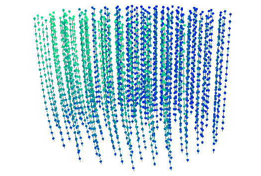

# OMsway

**Model how the strings of a water-based neutrino telescope sway under sea
currents, and generate the displaced detector geometries that result.**



Water Cherenkov neutrino telescopes (KM3NeT/ARCA & ORCA, P-ONE, TRIDENT) are
built from long, near-vertical strings of optical modules, each anchored to the
seabed and held up by a buoyant float. A horizontal sea current drags on the
string; with nothing rigid to resist it, the string bows over and its optical
modules are pushed downstream — by an amount that grows with height up the
string and with the square of the current speed. On ARCA's ~690 m strings this
reaches tens of metres.

Reconstruction and simulation frameworks usually assume the detector geometry is
static and perfectly known. OMsway computes the real, current-driven shape of
each string and produces the displaced module positions and orientations, so you
can study how that mismatch affects event reconstruction.

<sub><em>(Animation, right: a stylized decorative render — see <a href="art/"><code>art/</code></a>; the physics and validation live in <a href="scripts/"><code>scripts/</code></a>.)</em></sub>

<br clear="all">

## The physics

A detector string is modelled as a **flexible, inextensible mooring line**: it
carries tension but has no bending stiffness, so its shape is fixed entirely by
the balance of forces along it. One end is anchored to the seabed; the other is
pulled taut by a buoyant float.

Parameterise the line by arc length `s`, from the anchor (`s = 0`) up to the buoy
(`s = L`). Cut it at any `s`; the portion above must be in static equilibrium
under three forces — the tension at the cut, the net **buoyancy** of everything
above (buoyancy minus weight, acting upward), and the horizontal **drag** the
current exerts on everything above. Since the line is tension-only, its tension
points along the local tangent, which gives the shape directly:

```
V(s) = Σ_{above s}  W_j                     net buoyancy above s   (upward, N)
H(s) = Σ_{above s}  ½·C_d·ρ·A_j·|u|·u        drag above s           (horizontal, N)
t(s) = (H_x, H_y, V) / |(H_x, H_y, V)|       unit tangent of the line
r(s) = anchor + ∫₀ˢ t(s') ds'               the displaced shape
```

**Elements.** Optical modules and the buoy are **point** elements — each with a
net buoyancy `W` (N) and a drag factor `f = ½·C_d·ρ·A` set by its frontal area
`A` and drag coefficient `C_d`. The cable is a **distributed** element, adding
drag and net buoyancy *per unit length*. `ρ` is the seawater density, `u` the
local current velocity.

**Quadratic, directional drag.** Drag goes as `|u|·u` — quadratic in speed, so a
string's deflection grows roughly as `v²` in the gentle regime and with height up
the line. Because the current is a vector that may rotate with depth, `H` is a
full horizontal vector: a string in a directionally-sheared current bows *out of
a single vertical plane*.

**Large-angle and coupled.** No small-angle approximation is used — the tangent
is normalised exactly, so the model stays valid when a ~700 m string leans over
by tens of metres. The drag on each element depends on the current at that
element's own (displaced, initially unknown) position, so the shape is found by
fixed-point iteration starting from the straight, vertical string.

**Limiting check.** When the current is weak the line barely tilts, the tension
is essentially the constant top buoyancy `B`, and the shape collapses to the
closed-form parabola `r = q·L²/(2B)` for a uniform drag load `q` per unit length.
The solver reproduces this exactly — one of the checks in `scripts/validate.py`.

The approach follows the ANTARES line-shape / detector-positioning model
([arXiv:1202.3894](https://arxiv.org/abs/1202.3894)), also used by KM3NeT.

## Module orientation: tilt and torsion

A tilted, rotated optical module needs more than a position for a faithful
optical simulation — it needs its full orientation. OMsway tracks two independent
degrees of freedom:

- **Tilt** — the module's symmetry axis. A module is clamped to the rope, so it
  tilts with the local line tangent; the solve therefore sets each `module.axis`
  (a unit vector, with angle-from-vertical `module.tilt`) directly from the shape
  it already computes. Tilt is *predicted* — near-zero just under the buoy,
  largest near the anchor, leaning downstream.
- **Torsion** — the roll about that axis (the DOM heading/yaw). A current exerts
  no torque about a symmetric module's axis, and a KM3NeT two-rope string is
  torsionally stiff, so the sway solve says nothing about it; in real detectors
  it is fixed at deployment and measured in situ by the module compass (to a few
  degrees). OMsway supplies it separately through a `TorsionModel` that sets
  `module.torsion` as a per-string constant + yaw model + random scatter — the
  built-in `RandomScatter` reproduces the small per-module heading spread a
  compass sees.

`module.reference_vector()` combines the two into the DOM heading marker: the
body `+x` direction carried through the tilt and rolled by the torsion. These
orientations feed PPC's next-gen mode as `cx.dat` (per-DOM tilt) and `dx.dat`
(per-DOM cable azimuth); see `Geometry.write_ppc_geometry`.

## Installation

The dependencies live in a conda environment defined by `environment.yml`
(Python 3.12; the core is pure NumPy, with `plotly` for the optional 3-D
viewer):

```bash
mamba env create -f environment.yml   # or: conda env create -f environment.yml
mamba activate omsway
```

This installs `omsway` as an editable package, so `import omsway` works from
anywhere in the environment.

## Quickstart

OMsway reads a detector layout from a [Prometheus](https://github.com/Harvard-Neutrino/prometheus)
`.geo` file (Prometheus ships geometries for ARCA, ORCA, IceCube, P-ONE, TRIDENT,
and more under `resources/geofiles/`). A `.geo` file lists only the optical
modules, so you supply the per-string buoy and cable, plus the seabed depth:

```python
import numpy as np
from omsway import Geometry, Buoy, CylindricalCable, UniformCurrent, Solver

# 1. Load the nominal (undisplaced) detector.
geo = Geometry.from_prometheus_geo(
    "arca.geo",
    buoy=Buoy(buoyancy=1350.0, c_w=0.8, area=0.25),          # net lift [N], drag coeff, frontal area [m²]
    cable=CylindricalCable(diameter=0.05, buoyancy_per_length=-0.5, c_w=1.2),
    buoy_gap=38.0,      # buoy sits this far above the topmost module [m]
    z_floor=-3540.0,    # seabed depth the strings anchor to [m]
)

# 2. Bend it under a current (0.15 m/s toward +x). solve() writes the displaced
#    positions and each module's tilt back onto the geometry, and returns
#    per-string diagnostics.
current = UniformCurrent(speed=0.15, azimuth_deg=0.0)
Solver().solve(geo, current)

# 3. Read the displacement field, or write the displaced detector back out.
offset = np.linalg.norm(geo.displacements(), axis=1)   # per-module displacement [m]
print(f"max module displacement: {offset.max():.1f} m")

geo.to_prometheus_geo("arca_displaced.geo")            # feed straight back into Prometheus
```

Currents can vary with depth (and time). A depth-resolved profile — say, slow at
the seabed and faster and rotated near the top — is just another current model:

```python
from omsway import DepthProfileCurrent

current = DepthProfileCurrent.from_speed_azimuth(
    z_nodes=[-3540.0, -2850.0], speed=[0.02, 0.15], azimuth_deg=[0.0, 45.0],
)
Solver().solve(geo, current)
```

And you can view the result interactively (needs `plotly`):

```python
from omsway import viz

viz.write_html(viz.plot(geo, title="ARCA @ 0.15 m/s"), "arca_displaced.html")
```

The view draws each module's tilt and heading as small arrows, with checkboxes in
the page to toggle them on and off.

### Orientation output for PPC

The solve already set each module's **tilt** (`module.axis`). Assign the
**torsion** (the roll/heading the solve leaves open) and write the geometry files
PPC's next-gen mode reads for tilted, rotated modules:

```python
from omsway import RandomScatter

RandomScatter(sigma=np.radians(3.0), seed=0).apply(geo, current)  # ~3° heading spread

paths = geo.write_ppc_geometry("ppc_inputs/")
# ppc_inputs/geometry.geo · cx.dat (per-DOM tilt) · dx.dat (per-DOM cable azimuth)
```

In a Prometheus run the `.geo` is the geofile and `cx.dat`/`dx.dat` go in the
`ppctables` directory PPC reads.

## What's in the package

| Module | Contents |
|---|---|
| `omsway.currents` | `CurrentModel` (abstract water-velocity field over position & time), and the built-ins `UniformCurrent` and `DepthProfileCurrent`. |
| `omsway.geometry` | The detector tree `Geometry → String → Module`, with `Module` subtypes `SphericalOM` (an optical module) and `Buoy`, and a `Cable` (`CylindricalCable`) per string. Each module carries its orientation — `axis`/`tilt`, `torsion`, and `reference_vector()`. Loads/saves Prometheus `.geo` files, reports `displacements()`, and writes the PPC orientation inputs (`to_cx_dat`, `to_dx_dat`, `write_ppc_geometry`). |
| `omsway.solver` | `Solver` — the arc-length force-balance solver — and `StringShape`, its per-string result (bent rope curve, displaced positions, convergence). `solve()` writes back each module's displaced position and its tilt (`axis`). |
| `omsway.torsion` | `TorsionModel` (abstract: per-string constant + yaw model + random scatter) and `RandomScatter`, which assign each module's `torsion` — the DOM roll/heading the sway solve does not determine. |
| `omsway.viz` | An interactive 3-D plotly view of a displaced detector against its nominal baseline, with per-module tilt and heading arrows and in-page on/off toggles for them. |

Two ready-to-run scripts:

```bash
python scripts/study.py       # sweep current speeds, write a displaced .geo for each
python scripts/validate.py    # solver validation against closed-form limits
```

`scripts/validate.py` checks the solver against cases with known answers: the
small-angle deflection limit `r = q·L²/2B`, arc-length conservation, and the
quadratic (`v²`) scaling of deflection with current speed.

## Scope and assumptions

- **Static snapshots.** Each solve is a steady-state equilibrium for a given
  current, not a time-dynamics simulation. (A `time` argument is threaded through
  so a time-dependent `CurrentModel` can produce a sequence of snapshots.)
- **Water detectors with buoyant vertical strings.** The mooring-line model
  assumes a seabed-anchored string held taut by a top buoy.
- **Horizontal drag, vertical buoyancy.** Abyssal currents are nearly horizontal,
  so drag bends the string sideways while buoyancy sets the restoring tension.
- **Orientation is tilt + torsion.** The solve sets each module's tilt (its axis
  follows the rope tangent); the torsion (roll/heading) is *not* determined by the
  sway — a current exerts no torque about a symmetric module's axis — so it is
  supplied by a `TorsionModel` and, in reality, measured by the module compass.
- **Drag magnitude is a calibration knob.** `Solver(drag_scale=…)` scales all
  drag terms; with `drag_scale = 1` (the default) the *shape* is physical but the
  absolute deflection should be calibrated against a known measurement for a
  given detector.

## Development

Linting and formatting run through [ruff](https://docs.astral.sh/ruff/) on
[pre-commit](https://pre-commit.com/). Once the environment is active:

```bash
pre-commit install         # run the hooks on every commit
pre-commit run --all-files # or check the whole tree now
```

## Contributing

Contributions go through a fork and pull request:

1. **Fork** the repository to your own account and **clone** your fork.
2. Create the environment (`mamba env create -f environment.yml`) and run
   `pre-commit install` so formatting and linting run on every commit (see
   [Development](#development)).
3. **Create a branch** for your change: `git checkout -b my-feature`.
4. Make your changes and **commit** them on that branch.
5. **Push** the branch to your fork and **open a pull request** against `main`,
   describing what changed and why.

Please keep pull requests focused, and make sure `pre-commit run --all-files`
passes before opening one.

## References

- S. Adrián-Martínez et al. (ANTARES), *"The positioning system of the ANTARES
  neutrino telescope"*, [arXiv:1202.3894](https://arxiv.org/abs/1202.3894) — the
  line-shape / detector-positioning model this solver follows.
- KM3NeT Collaboration, *"Sensitivity of the KM3NeT/ARCA detector"*,
  [arXiv:2007.16090](https://arxiv.org/abs/2007.16090) — ARCA geometry and the
  benchmark string deflection.
- KM3NeT Collaboration, *"KM3NeT Detection Unit Line Fit reconstruction using
  positioning sensors data"*, [arXiv:2109.04914](https://arxiv.org/abs/2109.04914)
  — the acoustic + compass model behind per-module position and orientation.
- [Prometheus](https://github.com/Harvard-Neutrino/prometheus) — the simulation
  package whose `.geo` detector files OMsway reads and writes.
